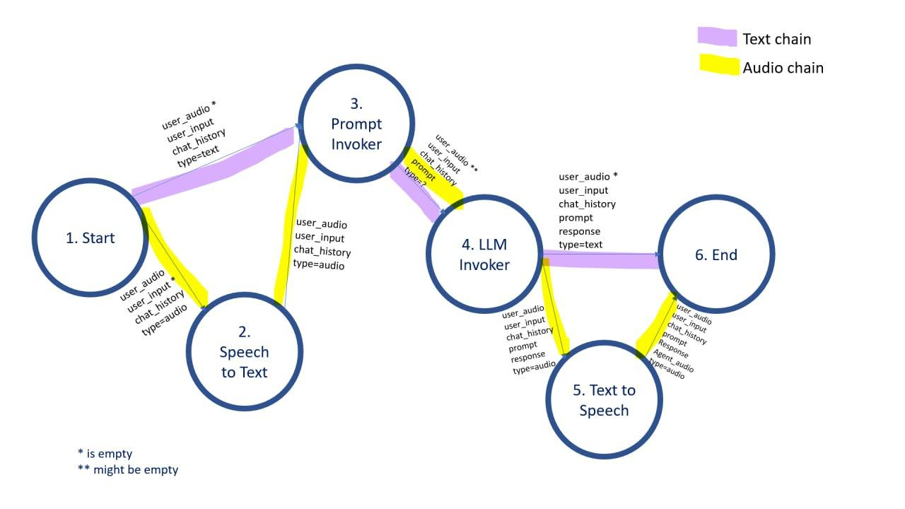

# MultiAgent

<p align="center">
  
</p>


A full-stack web application that lets users create and chat with custom AI agents powered by OpenAI. Each agent has its own system prompt (persona/instructions), and conversations support both text and voice — users can speak to agents and receive spoken responses back.

---

## Table of Contents

- [Features](#features)
- [Architecture](#architecture)
- [Project Structure](#project-structure)
- [Prerequisites](#prerequisites)
- [Getting Started](#getting-started)
  - [Environment Variables](#environment-variables)
  - [Running with Docker](#running-with-docker)
  - [Running Locally](#running-locally)
- [API Reference](#api-reference)
- [LangChain Processing Chains](#langchain-processing-chains)
- [Database Schema](#database-schema)
- [Frontend](#frontend)
- [Running Tests](#running-tests)
- [Contributing](#contributing)

---

## Features

- **User Authentication** — Register, log in, and manage sessions with JWT-based auth.
- **Custom Agents** — Create multiple AI agents, each with a unique name and system prompt defining its personality and expertise.
- **Multi-Chat Support** — Start multiple independent chat sessions with each agent, with full message history.
- **Text Messaging** — Send text messages and receive AI-generated replies in real time.
- **Voice Messaging** — Record audio, have it transcribed via OpenAI Whisper (STT), send it to the LLM, and receive an audio response via OpenAI TTS.
- **Audio Download** — Download any audio message (user or agent) via a dedicated endpoint.
- **Paginated History** — Retrieve messages with configurable pagination (`start_index`, `n`).
- **Dockerized** — Single-command startup with Docker Compose; live-reload via volume mounts.

---

## Architecture

```
┌─────────────────────────────────────────┐
│                Frontend                 │
│   Vanilla JS (auth, agents, chat,       │
│   audio recording/playback)             │
└────────────────────┬────────────────────┘
                     │ HTTP / REST
┌────────────────────▼────────────────────┐
│           FastAPI Backend               │
│                                         │
│  ┌──────────────────────────────────┐   │
│  │         LangChain Chains         │   │
│  │                                  │   │
│  │  Text:  Prompt → LLM             │   │
│  │  Audio: STT → Prompt → LLM → TTS │   │
│  └──────────────────────────────────┘   │
│                                         │
│  SQLite / SQLAlchemy ORM               │
└─────────────────────────────────────────┘
                     │
        ┌────────────▼────────────┐
        │      OpenAI APIs        │
        │  GPT-4o · Whisper · TTS │
        └─────────────────────────┘
```

The backend is a **FastAPI** application using **SQLAlchemy** with a SQLite database. Message processing is handled through composable **LangChain** `RunnableLambda` chains. The frontend is plain HTML/CSS/JavaScript (no framework) served statically.

---

## Project Structure

```
multiagent-master/
├── backend/
│   ├── main.py              # FastAPI app, all route definitions
│   ├── models.py            # SQLAlchemy ORM models
│   ├── schemas.py           # Pydantic request/response schemas
│   ├── database.py          # Database engine and session setup
│   ├── auth.py              # JWT auth, password hashing, dependency injection
│   ├── history_manager.py   # Paginated message retrieval logic
│   ├── chain_wrapper.py     # Prepares data and dispatches to text/audio chains
│   └── core/
│       ├── chains.py        # Defines text_chain and audio_chain
│       ├── models/
│       │   ├── llm.py       # OpenAI GPT-4o wrapper
│       │   ├── stt.py       # OpenAI Whisper (speech-to-text)
│       │   └── tts.py       # OpenAI TTS (text-to-speech)
│       └── invokers/
│           ├── llm_invoker.py     # RunnableLambda wrapping LLM call
│           ├── prompt_invoker.py  # RunnableLambda building the prompt
│           ├── stt_invoker.py     # RunnableLambda for transcription
│           └── tts_invoker.py     # RunnableLambda for speech synthesis
├── frontend/
│   ├── index.html           # Single-page app shell
│   ├── css/styles.css
│   └── js/
│       ├── app.js           # Entry point, session management
│       ├── auth.js          # Login/register UI logic
│       ├── agents.js        # Agent sidebar management
│       ├── chat.js          # Chat UI, message rendering
│       ├── audio.js         # MediaRecorder, audio playback
│       ├── api.js           # Fetch wrapper with auth headers
│       ├── config.js        # API base URL, localStorage keys
│       └── storage.js       # LocalStorage helpers
├── tests/
│   └── test_main.py         # Pytest test suite
├── Dockerfile
├── docker-compose.yml
├── requirements.txt
└── pytest.ini
```

---

## Prerequisites

- **Python 3.10+** (for local development)
- **Docker & Docker Compose** (for containerised setup)
- **OpenAI API Key** with access to:
  - `gpt-4o` (chat completions)
  - `whisper-1` (speech-to-text)
  - A TTS model (text-to-speech)

---

## Getting Started

### Environment Variables

Create a `.env` file in the project root:

```env
OPENAI_API_KEY=sk-...
SECRET_KEY=your-jwt-secret-key
```

| Variable         | Description                                    |
|------------------|------------------------------------------------|
| `OPENAI_API_KEY` | Your OpenAI API key                            |
| `SECRET_KEY`     | Secret used to sign JWT tokens                 |
| `DATABASE_URL`   | Database URL                                   |

---

### Running with Docker

The easiest way to get started:

```bash
docker compose up --build
```

The API will be available at `http://localhost:8000`.

The backend volume is mounted for live-reload — changes to files in `backend/` are reflected immediately without rebuilding the image.

To stop the application:

```bash
docker compose down
```

---

### Running Locally

**1. Create and activate a virtual environment:**

```bash
python -m venv venv
source venv/bin/activate      # macOS/Linux
venv\Scripts\activate         # Windows
```

**2. Install dependencies:**

```bash
pip install -r requirements.txt
```

**3. Set environment variables:**

```bash
cp .env.example .env
# Edit .env with your values
```

**4. Start the FastAPI server:**

```bash
uvicorn backend.main:app --reload --port 8000
```

**5. Open the frontend:**

Open `frontend/index.html` directly in your browser, or serve it with any static file server:

```bash
npx serve frontend
```

**6. Explore the interactive API docs:**

Navigate to `http://localhost:8000/docs` for the Swagger UI.

---

## API Reference

All endpoints except `/register/` and `/login/` require a Bearer token in the `Authorization` header.

### Auth

| Method | Endpoint       | Description                  |Notes                          |
|--------|----------------|------------------------------|-------------------------------|
| POST   | `/register/`   | Create a new user account    |                               |
| POST   | `/login/`      | Authenticate and get a token |                               |
| GET    | `/users/me/`   | Get current user info        |For testing only. Unused in app|

### Agents

| Method | Endpoint             | Description                          |
|--------|----------------------|--------------------------------------|
| POST   | `/agents/`           | Create a new agent                   |
| GET    | `/agents/`           | List all agents for the current user |
| GET    | `/agents/{id}/`      | Get agent details (with chat list)   |
| PUT    | `/agents/{id}/`      | Update an agent's name/system prompt |

### Chats & Messages

| Method | Endpoint                            | Description                                      |Notes
|--------|-------------------------------------|--------------------------------------------------|--------------------------------------------------------------------------------------------------|
| POST   | `/chats/`                           | Create a new chat session for an agent           |
| GET    | `/chats/{chat_id}/messages/`        | Get paginated messages (`start_index`, `n`)      |
| POST   | `/chats/{chat_id}/upload-audio/`    | Upload a user audio file (WAV), returns message ID | You have to upload before calling '/send/'                                                                                                |
| POST   | `/send/`                            | Send a message (text or audio) and get a reply  | For audio messages, you have to upload the WAV file first and then send an empty text with the `audio` key set to the id recieved from upload request|
| GET    | `/messages/{message_id}/download/`  | Download an audio message (MP3/WAV)              | with the `audio`key set to the id recieved from the '/send/' request

**Send request payload:**

```json
{
  "chat_id": 1,
  "text": "Hello!",
  "audio": null
}
```

For audio messages, first upload wav file via `/chats/{chat_id}/upload-audio/`, then pass the returned `message_id` as the `audio` field in `/send/`.

---

## LangChain Processing Chains




Message processing uses composable LangChain `RunnableLambda` pipelines defined in `backend/core/chains.py`:

```
Text chain:   prompt_invoker | llm_invoker
Audio chain:  stt_invoker | prompt_invoker | llm_invoker | tts_invoker
```

The `chain_wrapper.py` inspects each incoming message — if `is_audio` is `True`, it reads the saved `.wav` file and routes through the audio chain; otherwise it routes through the text chain.

**Data dictionary passed through the chain:**

| Key                | Set by          | Description                                    |
|--------------------|-----------------|------------------------------------------------|
| `agent_name`       | chain_wrapper   | Name of the agent                              |
| `system_prompt`    | chain_wrapper   | Agent's system prompt                          |
| `history`          | chain_wrapper   | List of prior messages for context             |
| `user_text`        | chain_wrapper / stt_invoker | The user's message text               |
| `user_audio`       | chain_wrapper   | Path to the user's audio file (audio flow)    |
| `agent_text`       | llm_invoker     | The LLM's text response                        |
| `agent_audio_bytes`| tts_invoker     | Raw MP3 bytes of the spoken response           |

---

## Database Schema

```
users
  id, username (unique), email (unique), hashed_password

agents
  id, user_id → users, name, system_prompt
  UNIQUE(user_id, name)     ← agent names are unique per user

chats
  id, agent_id → agents, name, created_at, last_message_at

messages
  id, chat_id → chats, is_agent, is_audio, text, sent_at
```

All relationships cascade deletes — removing a user removes all their agents, chats, and messages.

Audio files are stored on disk under `backend/media/`:
- User audio: `user_{username}_{message_id}.wav`
- Agent audio: `agent_{username}_{message_id}.mp3`

---

## Frontend

The frontend is a single-page application written in vanilla JavaScript, split across focused modules:

| Module       | Responsibility                                      |
|--------------|-----------------------------------------------------|
| `app.js`     | Entry point, session check, login/logout routing    |
| `auth.js`    | Login and registration form handling                |
| `agents.js`  | Agent sidebar: listing, creation, selection         |
| `chat.js`    | Message list rendering, send form handling          |
| `audio.js`   | `MediaRecorder` capture, upload, and playback       |
| `api.js`     | Fetch wrapper that injects the JWT Bearer token     |
| `config.js`  | API base URL and localStorage key constants         |
| `storage.js` | Read/write helpers for localStorage                 |

---

## Running Tests

```bash
pytest -v
```

To run with coverage:

```bash
pytest --cov=backend --cov-report=term-missing
```

Test configuration is in `pytest.ini`.

---

## Video Examples

Three video examples can be found [here](https://drive.google.com/drive/folders/1LGkyrXAwwBtAQHrOTb_wOfnHn7oW_NKu)

- `edit_agent_new_chat_text_and_audio.mp4`: A video shows editing an agent by adding some clarifications to its system prompt, then opening new chat and exchanging messages with the agent in both text and audio.
- `login_select_chat_and_scroll_up.mp4`: A video shows the login process, and opening a certain chat with ~30 messages and scrolling up to the top of the chat. The app retrieves messages ten by ten whenever the scroll reachess the top until there's no more messages to retrieve. 
- `new_agent_new_chat_and_text.mp4`: A video shows creating new agent, then creating new chat, and exchanging with it via text messages.